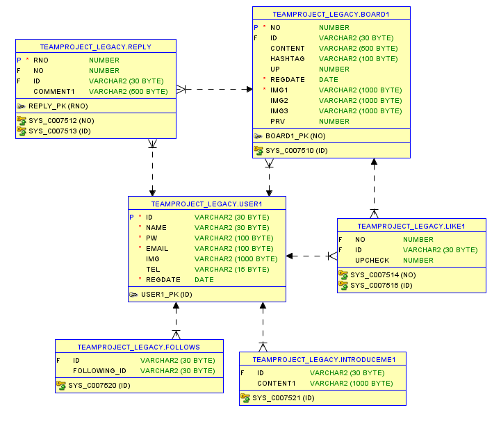
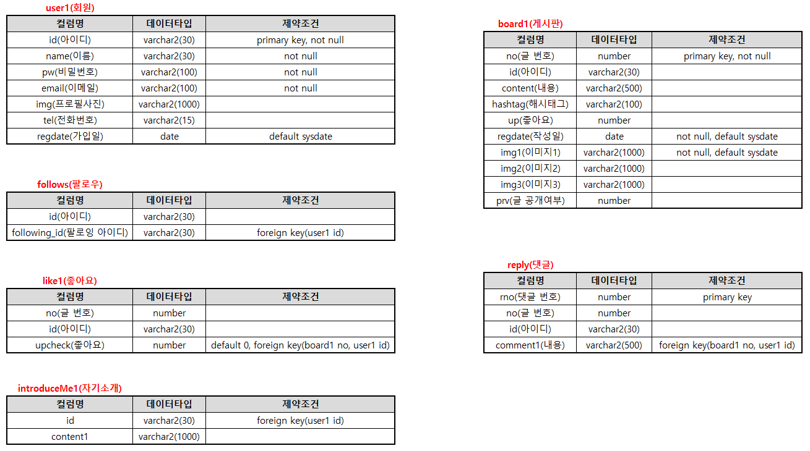
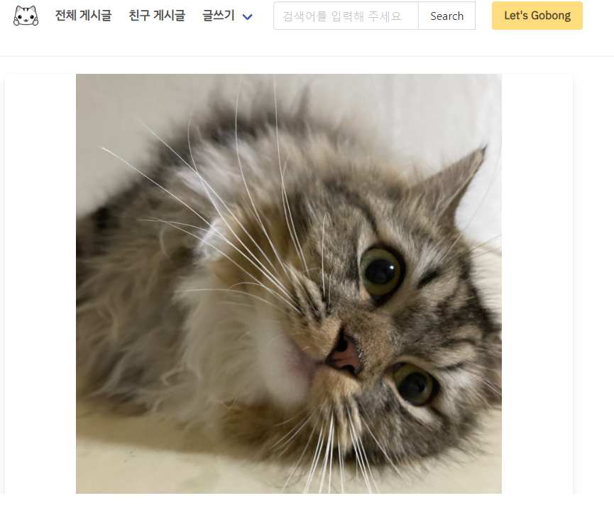

# GOBONG 프로젝트
"당신의 반려동물 일상을 공유하세요! 소셜 네트워크 서비스 [고봉 프로젝트] 입니다."

## 팀프로젝트
김우주, 박지현, 손승기, 이재호, 전재영, 조태정
### 내 기여도
- 게시물 CRUD 및 댓글 CRUD
- 게시물 이미지 슬라이드 적용
- 글 목록보기, 댓글 목록보기 프론트 구현

## 🔧사용 기술
- IDE: STS-3.9.18.RELEASE
- JAVA ver: 11.0.18
- JAVA script ver: 1.0
- Dynamic Web Module: 4.0
- Server: Apache Tomcat v9.0
- DBMS: Oracle 11 xe
- External Library: json, cos, commons
- JAVA Script Plugin: JQuery
- CSS FrameWork: bulma.io v0.9.4

## 💡 주요 기능
- 게시판 이용(작성, 수정, 삭제, 조회)
- 공개범위별 게시글 분류(전체공개, 친구공개, 비공개)
- 이미지 업로드 기능
- 로그인한 사람만 좋아요, 댓글 기능
- 팔로워, 팔로잉 기능
- 검색기능(사용자, 해시태그)
- 사용자 프로필 사진 추가

## 📷 ERD설계 및 테이블 설계도

  
  

## 📷 프로젝트 주요 화면

  

#### 👉 기타 화면은 PDF 참고해주세요!
🔗[PDF 파일 다운로드](images/project_detail.pdf) 